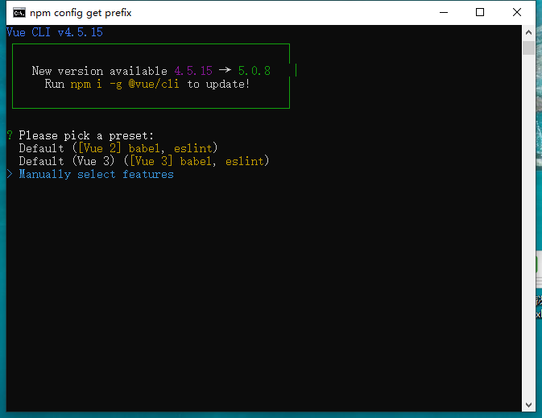
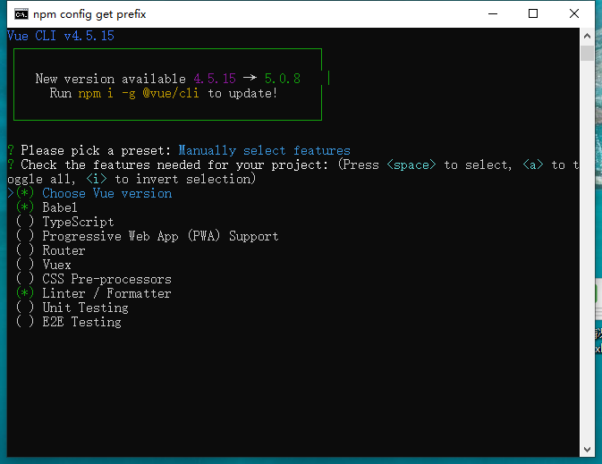
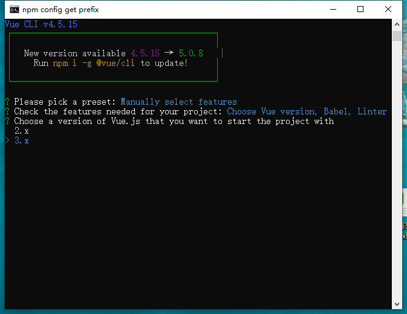
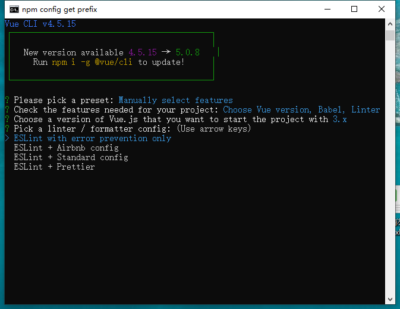
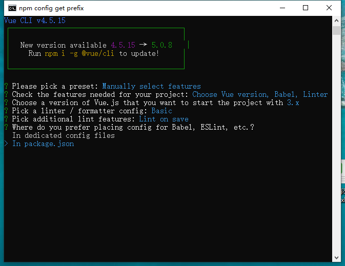
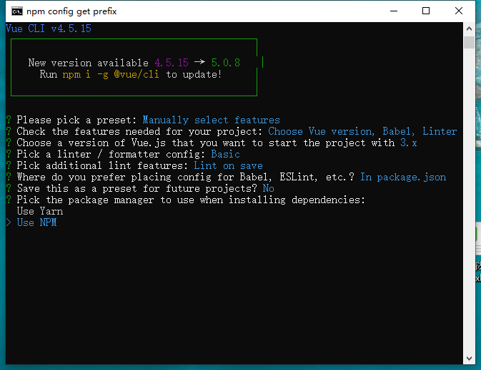
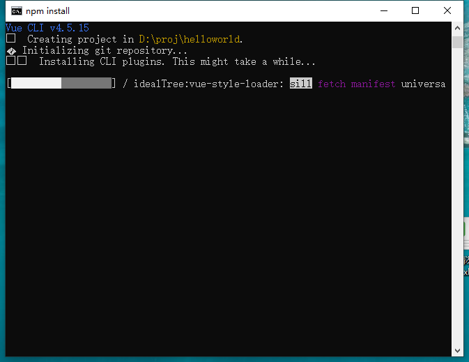

# 第13章 Vue CLI

在开发大型单页应用时,需要考虑项目的组织结构、项目构建、部署、热加载、代码单元测试等多方面与核心业务逻辑无关的事情,对于项目中用到的构建工具\\代码检查工具等还需要一遍一遍地重复配置。显然,这很浪费时间,影响开发效率。为此,我们会选择一些能够创建脚手架的工具,来帮助搭建一个项目的框架,并进行一些项目所依赖的初始配置。

在Vue.js环境中,这个脚手架工具就是Vue CLI,利用这个工具,可以自动生成一个基于Vue.js的单页应用的脚手架项目。

## 13.1 简介

Vue CLI是一个基于Vue.js进行快速开发的完整系统,在Vue3.0版本正式发布时,Vue CLI将包名由原来的vue-cli改成了@vue/cli。

Vue CLI有3个组件。

1. CLI(@vue/cli)<br>
全局安装的npm包,提供了终端里的vue命令(如vue create、vue serve、vue ui等).它提供了通过vue create快速搭建新项目的能力,或者通过vue serve即时原型化新想法的能力.我们还可以通过vue ui使用图形用户界面管理项目.

2. CLI服务(@vue/cli-service)<br>
CLI服务是一个开发环境依赖.它是一个npm包,本地安装到@vue/cli创建的每个项目中.CLI服务是构建于webpack和webpack-dev-server之上的,包含:
+ 加载其他CLI插件的核心服务;
+ 一个为绝大部分应用优化过的内部webpack配置;
+ 项目内部的vue-cli-service命令,包含基本的serve、build和inspect命令。

3. CLI插件<br>
CLI插件是给Vue项目提供可选功能的npm包(如Babel/TypeScript转译、ESLint集成、单元测试和端到端的测试等)。Vue CLI插件的名字以@vue/cli-plugin-(用于内置插件)或vue-cli-plugin-(用于社区插件)开头,非常容易使用.当在项目内部运行vue-cli-service命令时,他会自动解析并加载项目的package.json文件中列出的所有CLI插件。

插件可以作为项目创建过程的一部分包括在项目中,也可以稍后添加到项目中。

## 13.2 安装

安装命令:
```
npm install -g @vue/cli
或者
yarn global add @vue/cli
```
Vue CLI在Vue项目开发中基本是必须的,因此要采用全局安装.然后查看版本
```
vue --version
```

## 13.3 创建项目

安装完Vue CLI,就可以开始创建脚手架项目了。创建项目有两种方式:一种是通过vue create \<项目名\>命令,以命令行方式创建一个项目;另一种是通过vue ui命令启动图形界面创建项目。

### 13.3.1 vue create

选择好项目存放的目录,打开命令提示符窗口,输入vue create helloworld,开始创建一个helloworld项目。



>提示:<br>
>项目名中不能有大写字母

首先会让你选择一个preset(预设),第1和第2个选项是默认设置,适合快速创建项目的原型,在本书中,我们不会用到第一个选项,因为它是针对vue 2.x版本的。第3个选项需要手动对项目进行配置,适合有经验的开发者。这里使用方向下选择第3项,然后按Enter键,出现项目的配置选项，如下图。



手动配置项目中各选项的说明

选项 | 说明 |
---------------|-------------------------|
Choose Vue version | 选择Vue的版本
Babel   | 转码器,用于将ES6代码转为ES5代码,从而在现有环境下执行 |
TypeScript   | TypeScript是JavaScript的一个超集,主要提供了类型系统和对ES6的支持.TypeScript是由微软开发的开源编程语言,它可以编译成纯JavaScript,编译出来的是JavaScript可以运行在任何浏览器上 |
Progressive Web App(PWA) Support | 支持渐进式Web应用程序 |
Router | vue-router,参见14章
Vuex | Vue的状态管理,参见16章
CSS Pre-processors | CSS预处理器(如Less,Sass) |
Linter/Formatter | 代码风格检查和格式检验(如ESLint) |
Unit Testing | 单元测试 |
E2E Testing | 端到端测试 |

保持默认的Choose Vue version、Babel和Linter/Formatter的选中状态,按Enter键,接下来会根据选择的功能提示选择具体的功能包,或者进一步配置,如下图。



选中3.x(Preview),按Enter键,开始配置代码格式和校验选项,如下图：



第1个选项是指ESLint仅用于错误预防,后3个选项是选择ESLint和哪一个代码规范一起使用.ESLint是用于代码校验的,至于代码风格,则由另外的规范来限制,如这里的Airbnb config、Standard config和Prettier。至于选择哪一种代码规范,这要看个人的喜好或公司的要求。这里先保持默认选择,即第1个选项ESLint with error prevention only。

接下来是选择合适检测代码


这里选择第一项:保存时检测。接下来是询问如何存放配置信息，如下图：



第1个选项是指在专门的配置文件中存放配置信息,第2个选项是把配置信息放到package.json文件中.关于这个文件,后面的13.6小节有详细介绍。

选择第1个选项并按Enter键,接下来询问是否保存本次配置,保存的配置可以供以后项目使用.如果选择了保存,以后再用vue create命令创建项目时,就会出现保存过的配置,然后直接选择该配置即可。


输入y并按Enter键,接下来是给本次配置取个名字,如下图：

输入名字并按Enter键,开始创建脚手架项目,这中间会根据配置自动下载需要的包。项目创建完成后,如下所示:




根据提示在命令提示符窗口中依次输入cd helloworld和npm run serve(运行项目)。运行结果如下图:

![]

打开chrome浏览器,输入http://localhost:8080/,即可看到这个脚手架项目的默认页面,如下图:

在命令提示符窗口中按Ctrl+C组合键即可.

vue create命令有一些可选项,可以输入vue create --help查看这些选项.具体的选项说明如下:
```
-p, --preset <presetName>       //忽略提示符并使用已保存的或远程的预设选项
-d, --default               //忽略提示符并使用默认预设选项
-i, --inlinePreset <json>   //忽略提示符并使用内联的JSON字符串预设选项
-m, --packageManager <command>  //在安装依赖时使用指定的npm客户端
-r, --registry <url>    //在安装依赖时使用指定的npm registry
-g, --git [message]  //强制git初始化,并指定初始化提交信息(可选的)
-n, --no-git    //跳过git初始化
-f, --force     //如果目标目录存在,则覆写它
--merge        //如果目标目录存在,则合并它
-c, --clone   //如果git clone获取远程预设选项
-x, --proxy <proxyUrl>    //使用指定的代理创建项目
-b, --bare    //创建脚手架项目时省略新手知道信息
--skipGetStarted    //跳过显示Get Started说明
-h, --help    //输出使用帮助信息
```
如果要删除自定义的脚手架项目的配置,则可以在操作系统的用户目录下找到.vuerc文件。该文件内容如下:
```
{
    "useTaobaoRegistry": true,
    "latestVersion": "4.5.9",
    "lastChecked": 1605617973063,
    "presets": {
        "hello": {
            "useConfigFiles": true,
            "plugins": {
                "@vue/cli-plugin-babel": {},
                "@vue/cli-plugin-eslint": {
                    "config": "prettier",
                    "lintOn": [
                        "save"
                    ]
                }
            },
            "vueVersion": "3"
        }
    },
    "packageManager": "npm"
}
{
    "useTaobaoRegistry": true,
    "latestVersion": "4.0.5",
    "lastChecked": 1572429301691,
    "presets": {
        "hello": {
            "useConfigFiles": true,
            "plugins": {
                "@vue/cli-plugin-babel": {},
                "@vue/cli-plugin-eslint": {
                    "config": "prettier",
                    "lintOn": [
                        "save"
                    ]
                }
            }
        }
    }
}
```

### 13.3.2 使用图形界面

localhost://8001/project/create

## 13.4 项目结构

Vue CLI生成的项目的目录结构及各目录和文件的用途说明如下:
```
|--node_modules                //项目依赖的模块
|--public                    //该目录下的文件不会被webpack编译压缩处理,引用的第三方库的js文件可以放在这里
|  |--favicon.ico           //图标文件
|  |--index.html           //项目住页面
|--src                  //项目代码的主目录
|  |--assets           //存放项目中的静态资源,如CSS\\图片等
|     |--logo.png       //logo图片
|  |--components         //编写的组件放在这个目录下
|     |--HelloWorld.vue    //Vue CLI创建的HelloWorld组件
|  |--App.vue         //项目的根组件
|  |--main.js         //程序入口js文件,加载各种公共组件和所需要用到的插件
|--.browserslistrc    //配置项目目标浏览器的范围
|--.eslintrc.js       //ESLint使用的配置文件
|--.gitignore         //配置在git提交项目代码时忽略哪些文件或文件夹
|--babel.config.js    //Babel使用的配置文件
|--package.json      //npm的配置文件,其中设定了脚本和项目依赖的库
|--package-lock.json   //用于锁定项目实际安装的各个npm包的具体来源和版本号
|--README.md         //项目说明文件
```
看一下几个关键文件的代码。例13-1所示。

例13-1 App.vue
```
<template>
  
  <HelloWorld msg="Welcome to Your Vue.js App"/>
</template>

<script>
import HelloWorld from './components/HelloWorld.vue'

export default {
  name: 'App',
  components: {
    HelloWorld
  }
}
</script>

<style>
#app {
  font-family: Avenir, Helvetica, Arial, sans-serif;
  -webkit-font-smoothing: antialiased;
  -moz-osx-font-smoothing: grayscale;
  text-align: center;
  color: #2c3e50;
  margin-top: 60px;
}
</style>
```
这就是一个典型的单文件组件,在一个文件中包含了组件代码、模板代码和CSS样式规则。这个组件引入了HelloWorld组件,然后在\<template\>元素中使用它.使用export语句将App组件作为模板的默认值导出。

App组件是项目的主组件,可以替换它,也可以保留它.如果保留,就是修改代码中的导入语句,将其替换为导入的组件即可。

main.js是程序入口JavaScript文件,该文件主要用于加载各种公共组件和项目需要用到的各种插件,并创建Vue的根实例。例13-2所示。

例13-2 main.js
```
import { createApp } from "vue";
import App from "./App.vue";

createApp(App).mount("#app");
```
在该文件中,使用import语句按需导入createApp,这就是Vue 3.0引入的Tree-shaking支持。不同于在HTML文件中的引用方式,前面章节是通过\<script\>元素引入Vue的js文件.后面基于脚手架项目的开发,对模块的引入都会采用这种方式。

接下来使用import语句引入App组件,调用createApp方法创建应用程序实例,调用mount方法在id为app的DOM元素上装载应用程序实例的根组件。

项目的主页面index.html的代码如例13-3所示。

例13-3 index.html
```
<!DOCTYPE html>
<html lang="">
  <head>
    <meta charset="utf-8">
    <meta http-equiv="X-UA-Compatible" content="IE=edge">
    <meta name="viewport" content="width=device-width,initial-scale=1.0">
    <link rel="icon" href="<%= BASE_URL %>favicon.ico">
    <title><%= htmlWebpackPlugin.options.title %></title>
  </head>
  <body>
    <noscript>
      <strong>We're sorry but <%= htmlWebpackPlugin.options.title %> doesn't work properly without JavaScript enabled. Please enable it to continue.</strong>
    </noscript>
    <div id="app"></div>
    <!-- built files will be auto injected -->
  </body>
</html>
```
可以看到一个id属性值为app的空的\<div\>元素，组件实例会动态挂载到该元素上。在这种方式下，就没有v-cloak指令的用武之地了。

## 13.5 编写一个Hello组件

根据上面的项目，在左边窗口可以看到项目的目录结构，右击components目录，从弹出的快捷菜单中选择【新建文件】选项，输入Hello.vue，创建一个单文件组件。编写代码如例13-4所示。

例13-4 Hello.vue
```
<template>
    <p>{{ message }}</p>
</template>

<script>
export default {
    data() {
        return {
            message: 'Hello, Vue.js'
        }
    }
}
</script>
```
打开App.vue文件，将HelloWorld组件替换为Hello组件。修改的代码如例13-5所示。

例13-5 App.vue
```
<template>
    <Hello />
</template>

<script>
import Hello from "@/components/Hello"

export default {
    name: "App",
    components: {
        Hello
    }
};
</script>
...
```
**导入语句中的@符号表示src目录，该符号用于简化路径的访问**。Hello组件没有写扩展名，这没有问题，因为项目内置的webpack能够自动添加后缀".vue"。

然后在终端输入命令***npm run serve***，开始运行项目，浏览器打开http://localhost/8080/

## 13.6 package.json

这是一个JSON格式的npm配置文件，定义了项目所需要的各种模块，以及项目的配置信息（如名称、版本、许可证等元数据），在项目开发中经常会修改该文件的配置内容，所以单独对这个文件的内容说明一下。代码如下：
```
{
  "name": "helloworld",    //项目名称
  "version": "0.1.0",       //项目版本
  "private": true,        //是否私有项目
  "scripts": {            //值是一个对象，其中指定了项目生命周期各个环节需要执行的命令
    "serve": "vue-cli-service serve",         //执行npm run serve,运行项目
    "build": "vue-cli-service build",         //执行npm run build,构建项目
    "lint": "vue-cli-service lint"           //执行npm run lint, 运行ESLint验证并格式化代码
  },
  "dependencies": {                   //配置项目依赖的模块列表，key是模块名称，value是版本范围
    "core-js": "^3.6.5",
    "vue": "^3.0.0"
  },
  "devDependencies": {               //这里的依赖是用于开发环境的，不发布到生产环境
    "@vue/cli-plugin-babel": "~4.5.15",
    "@vue/cli-plugin-eslint": "~4.5.15",
    "@vue/cli-service": "~4.5.15",
    "@vue/compiler-sfc": "^3.0.0",
    "babel-eslint": "^10.1.0",
    "eslint": "^6.7.2",
    "eslint-plugin-vue": "^7.0.0"
  },
  "eslintConfig": {
    "root": true,
    "env": {
      "node": true
    },
    "extends": [
      "plugin:vue/vue3-essential",
      "eslint:recommended"
    ],
    "parserOptions": {
      "parser": "babel-eslint"
    },
    "rules": {}
  },
  "browserslist": [
    "> 1%",
    "last 2 versions",
    "not dead"
  ]
}
```
在使用npm安装依赖的模块时，可以根据模块是否需要在生产环境下使用而选择附加-S（即--save,生产环境）或-D（即 --save-dev,开发环境）参数。例如，项目中使用了界面UI组件库element-ui，它肯定是要在生产环境中用到的，就可以执行下面的命令来安装。
```
npm install element-ui -S
//等同于
npm install element-ui --save
```
安装后会在dependencies中写入依赖项，在项目打包发布时，dependencies中写入的依赖项也会一起打包。

如果某个模块只是在开发环境中使用，则可以使用-D参数安装，在安装完成后将依赖项写入devDependencies,而在devDependencies中的依赖项，在项目打包发布时并不会一起打包。

在发布代码时，项目下的node_modules目录下都不会发布，那么在下载了别人的代码后，怎样安装依赖呢？这时可以在项目路径下执行npm install命令，该命令会根据package.json文件下载所需要的依赖。

## 13.7 小结

Vue CLI这一创建Vue脚手架项目的有用工具，熟练使用该工具，可以快速搭建符合项目要求的框架程序；同时介绍了脚手架项目中的一些重要配置文件，以及脚手架项目的结构，方便使用者上手